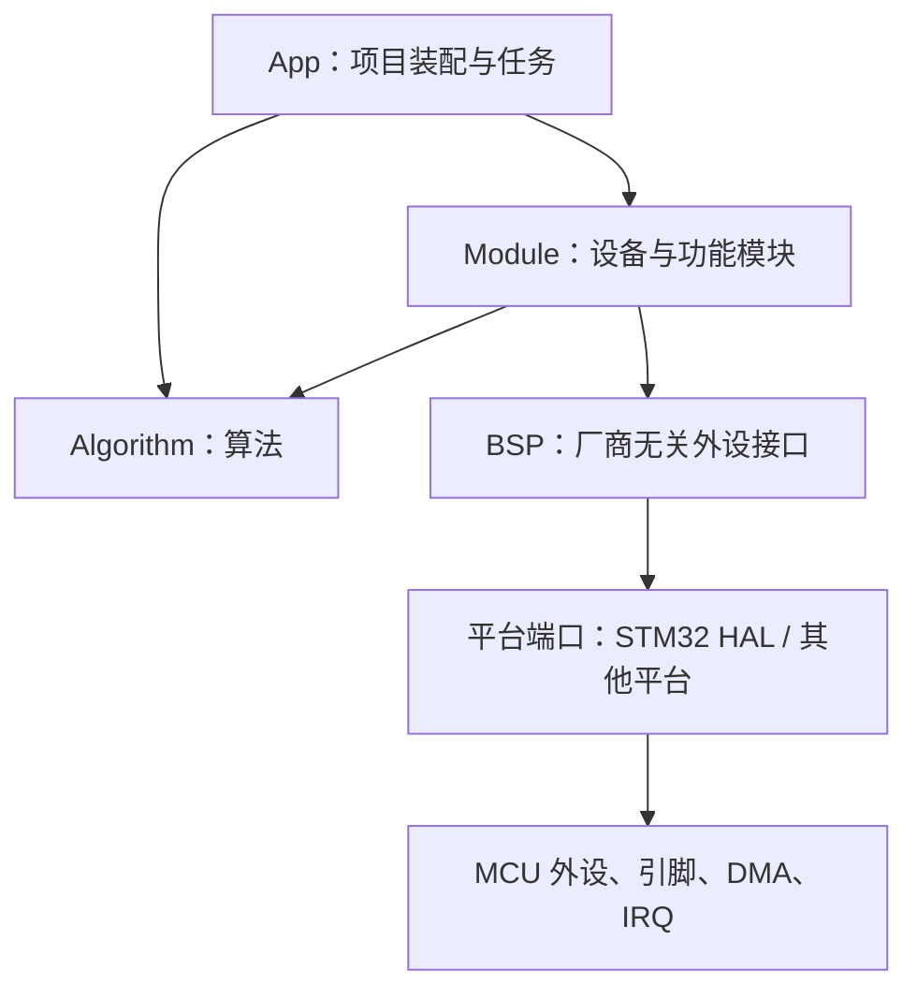

# General Framework

面向 RoboMaster 与通用运动控制项目的 C11 静态库框架。

这个仓库提供算法、外设抽象和设备模块，`User/App` 只保留项目层入口，不预设某一台机器人的引脚、外设实例和任务编排。库中的对象均支持静态分配、多实例和显式依赖注入，不使用动态内存。

## 快速导航

- [整体架构](#整体架构)
- [结构体命名规则](#结构体命名规则)
- [算法层](#算法层)
- [BSP 层](#bsp-层)
- [Module 层](#module-层)
- [主要可读数据](#主要可读数据)
- [通信协议](#通信协议)
- [初始化与运行顺序](#初始化与运行顺序)
- [硬件配置边界](#硬件配置边界)
- [构建](#构建)

## 整体架构

```text
User/
├── Algorithm/  与硬件无关的数学、滤波、估计、控制和底盘运动学
├── Bsp/        GPIO、总线、定时器等厂商无关外设对象
├── Module/     电机、传感器、遥控器、通信和功能设备
├── App/        最终项目的对象实例、模式、安全策略和任务编排
└── Doc/        本项目所依据的设备手册
```



依赖只能向下：

- `Algorithm` 不依赖 HAL、RTOS、BSP、Module 或 App。
- 通用 `Bsp` 不直接保存某个 STM32 全局句柄，通过 `device_handle + driver_ops` 接入平台。
- `Module` 只依赖所需的 BSP 和算法，不反向依赖 App。
- `App` 负责创建实例、选择硬件、连接对象和制定安全策略。

典型数据流：

```text
硬件接收
  → BSP 完成收发
  → Module 校验协议并形成强类型数据
  → Algorithm 估计或解算
  → App 决策
  → Module 生成执行器目标
  → BSP 发送到硬件
```

更详细的依赖约束见 [ARCHITECTURE.md](ARCHITECTURE.md)。

## 结构体命名规则

每个组件的公开头文件就是其完整 API。结构体名称遵循统一约定：

| 后缀或名称                           | 含义                               | 生命周期                                         |
| ------------------------------------ | ---------------------------------- | ------------------------------------------------ |
| `*_config_t`                         | 初始化配置、依赖对象、限幅和参数   | 通常只在初始化时读取；指针成员必须按注释保持有效 |
| `*_t`                                | 组件运行对象，保存状态、缓存和依赖 | 由调用者静态创建；初始化后只通过指针使用         |
| `*_data_t`                           | 已解析或已换算的业务数据           | 通常保存在对象内，通过 `get_data()` 获取只读指针 |
| `*_raw_data_t`                       | 未换算的传感器或协议原始值         | 用于标定和调试                                   |
| `*_feedback_t`                       | 执行器反馈                         | 位置、速度、电流、温度、在线状态等               |
| `*_state_t`                          | 状态机、算法或诊断运行状态         | 可通过 getter 读取，或作为调用者提供的状态存储   |
| `*_input_t` / `*_command_t`          | 单次更新输入或目标命令             | 调用更新函数时传入                               |
| `*_solution_t` / `*_target_t`        | 解算结果                           | 由正解、逆解或控制器写入                         |
| `*_statistics_t` / `*_diagnostics_t` | 计数器与诊断量                     | 用于在线监控和调参                               |
| `*_ops_t`                            | 面向调用者的操作表或虚表           | 只读，通常由实现文件静态定义                     |
| `*_driver_ops_t`                     | 平台驱动回调表                     | 由平台端口实现并注入 BSP                         |
| `*_status_t`                         | 函数返回状态码                     | 调用者应检查，不使用模糊的 `0/-1`                |

### C 语言对象模型

- 基类对象放在派生对象第一个成员，名称通常为 `super`。
- 基类通过只读 `vptr` 调用派生实现。
- 派生实现使用 `container_of` 从基类恢复完整对象。
- 多个实例共享只读操作表，各自保存运行状态。
- 不使用 `malloc`；对象、数组、工作区和 DMA 缓冲区均由调用者提供。
- 初始化后的对象不能按值复制，否则内部指针可能失效。

## 算法层

算法层目录为 `User/Algorithm`，全部使用 SI 单位和显式时间步长。

| 组件                   | 主要结构体                                                                                                                                                                                                   | 输入                                         | 输出或可观察数据                                            |
| ---------------------- | ------------------------------------------------------------------------------------------------------------------------------------------------------------------------------------------------------------ | -------------------------------------------- | ----------------------------------------------------------- |
| `alg_math`             | `alg_math_vector2_t`、`alg_math_vector3_t`、`alg_math_quaternion_t`、`alg_math_matrix_t`、`alg_math_statistics_t`                                                                                            | 标量、向量、矩阵、样本                       | 向量/矩阵结果，均值、方差、标准差；含一维查表与双线性插值   |
| `alg_filter`           | `alg_filter_low_pass_t`、`alg_filter_high_pass_t`、`alg_filter_exponential_t`、`alg_filter_moving_average_t`、`alg_filter_median_t`、`alg_filter_fir_t`、`alg_filter_biquad_t`、`alg_filter_complementary_t` | 新采样值、时间步长                           | 滤波输出以及对象内部历史状态                                |
| `alg_kalman`           | `alg_kalman_scalar_t`、`alg_kalman_linear_t`、`alg_kalman_extended_t`                                                                                                                                        | 状态、测量、模型函数、噪声矩阵               | 状态估计、协方差和创新计算结果                              |
| `alg_attitude`         | `alg_attitude_config_t`、`alg_attitude_quaternion_t`、`alg_attitude_rotation_matrix_t`、`alg_attitude_t`                                                                                                     | 三轴陀螺仪、三轴加速度计、`dt`               | 四元数、旋转矩阵、roll/pitch/yaw；支持 Mahony 与 Madgwick   |
| `alg_imu_ekf`          | `alg_imu_ekf_config_t`、`alg_imu_ekf_quaternion_t`、`alg_imu_ekf_euler_t`、`alg_imu_ekf_diagnostics_t`、`alg_imu_ekf_t`                                                                                      | 六轴 IMU 数据、`dt`                          | 四元数、欧拉角、陀螺零偏、校正角速度、重力方向和 EKF 诊断量 |
| `alg_pid`              | `alg_pid_config_t`、`alg_pid_input_t`、`alg_pid_terms_t`、`alg_pid_t`                                                                                                                                        | 目标、反馈、前馈、`dt`                       | P/I/D/FF 分量、限幅前输出和最终输出                         |
| `alg_pid` 扩展         | `alg_pid_incremental_t`、`alg_pid_gain_schedule_t`、`alg_pid_fuzzy_t`、`alg_pid_cascade_t`、`alg_pid_angle_t`                                                                                                | 增量误差、调度变量、模糊输入、位置与速度反馈 | 增量输出、调度增益、模糊修正、串级输出和角度控制输出        |
| `alg_lqr`              | `alg_lqr_controller_t`、`alg_lqr_dare_config_t`、`alg_lqr_finite_config_t`、`alg_lqr_angle_t`                                                                                                                | 状态、目标、系统矩阵、权重矩阵               | 控制量、DARE/有限时域结果和二维角度控制输出                 |
| `alg_trajectory`       | `alg_trajectory_config_t`、`alg_trajectory_state_t`、`alg_trajectory_t`、`alg_trajectory_group_t`                                                                                                            | 位置/速度目标、约束、`dt`                    | 位置、速度、加速度轨迹；梯形速度与 S 曲线                   |
| `alg_chassis`          | `alg_chassis_velocity_t`、`alg_chassis_pose_t`、`alg_chassis_constraint_t`、`alg_chassis_solution_t`                                                                                                         | 轮速约束或车体速度                           | 降级速度解、拟合残差、里程计位姿                            |
| `alg_chassis` 轮状态   | `alg_chassis_wheel_monitor_config_t`、`alg_chassis_wheel_monitor_wheel_state_t`                                                                                                                              | 各轮残差                                     | 故障/恢复计数和每轮故障标志                                 |
| `alg_mecanum`          | `alg_mecanum_config_t`、`alg_mecanum_t`                                                                                                                                                                      | `alg_chassis_velocity_t` 或四轮速度          | 四轮麦克纳姆逆解、正解和里程计                              |
| `alg_omni`             | `alg_omni_wheel_config_t`、`alg_omni_t`                                                                                                                                                                      | 车体速度或任意数量全向轮速度                 | 通用全向轮逆解、加权正解和里程计                            |
| `alg_swerve`           | `alg_swerve_command_t`、`alg_swerve_module_target_t`、`alg_swerve_t`                                                                                                                                         | 车体命令、舵角和轮速                         | 任意数量舵轮目标、正解和目标优化                            |

当前底盘解算只保留三类：

1. 麦克纳姆轮：`alg_mecanum`
2. 全向轮：`alg_omni`
3. 舵轮：`alg_swerve`

没有差速底盘和 Ackermann 解算。

### 算法层重点输出结构体

`alg_chassis_velocity_t`

| 字段                         | 数据            |
| ---------------------------- | --------------- |
| `velocity_x_m_per_s`         | 车体 X 方向速度 |
| `velocity_y_m_per_s`         | 车体 Y 方向速度 |
| `angular_velocity_rad_per_s` | 绕 Z 轴角速度   |

`alg_chassis_solution_t`

| 字段                                | 数据                               |
| ----------------------------------- | ---------------------------------- |
| `velocity`                          | 解算出的底盘速度                   |
| `residual_root_mean_square_m_per_s` | 约束拟合残差，用于判断轮速是否一致 |
| `used_constraint_count`             | 实际参与解算的约束数               |
| `unknown_component_count`           | 未知速度分量数量                   |
| `is_degraded`                       | 是否处于缺轮或缺约束的降级解算     |

`alg_pid_terms_t`

| 字段                 | 数据                   |
| -------------------- | ---------------------- |
| `proportional`       | 比例项                 |
| `integral`           | 积分项                 |
| `derivative`         | 微分项                 |
| `feedforward`        | 速度、加速度和额外前馈 |
| `unsaturated_output` | 限幅前输出             |
| `output`             | 最终限幅输出           |

`alg_trajectory_state_t`

| 字段                  | 数据           |
| --------------------- | -------------- |
| `position`            | 当前规划位置   |
| `velocity_per_s`      | 当前规划速度   |
| `acceleration_per_s2` | 当前规划加速度 |

`alg_imu_ekf_diagnostics_t`

| 字段                             | 数据                             |
| -------------------------------- | -------------------------------- |
| `filtered_accelerometer_m_s2[3]` | 滤波后的三轴加速度               |
| `innovation[3]`                  | 三维创新残差                     |
| `accelerometer_norm_m_s2`        | 加速度模长                       |
| `accelerometer_deviation_g`      | 相对 1g 的偏差                   |
| `normalized_innovation_squared`  | NIS，一致性诊断量                |
| `measurement_noise_scale`        | 当前自适应测量噪声倍率           |
| `was_accelerometer_used`         | 最近一次更新是否接受了加速度观测 |

## BSP 层

BSP 目录为 `User/Bsp`。通用 BSP 对象不决定使用哪个外设实例或引脚。

| BSP                      | 主要结构体                                                               | 能读取或观察的数据                             |
| ------------------------ | ------------------------------------------------------------------------ | ---------------------------------------------- |
| `bsp_common`             | `bsp_status_t`、`bsp_transfer_mode_t`、`bsp_event_t`、`bsp_device_ops_t` | 统一状态码、阻塞/中断/DMA 模式和事件类型       |
| `bsp_gpio`               | `bsp_gpio_t`、`bsp_gpio_config_t`、`bsp_gpio_driver_ops_t`               | `bsp_gpio_read()` 读取高低电平                 |
| `bsp_exti`               | `bsp_exti_t`、`bsp_exti_config_t`                                        | 通过回调观察外部中断事件                       |
| `bsp_usart`              | `bsp_usart_t`、`bsp_usart_config_t`                                      | 收发完成/错误回调，`bsp_usart_get_busy()`      |
| `bsp_spi`                | `bsp_spi_t`、`bsp_spi_config_t`                                          | 收发完成/错误回调，`bsp_spi_get_busy()`        |
| `bsp_i2c`                | `bsp_i2c_t`、`bsp_i2c_config_t`                                          | 内存读写、设备就绪状态和总线忙状态             |
| `bsp_can`                | `bsp_can_frame_t`、`bsp_can_filter_t`、`bsp_can_t`                       | 接收帧、发送邮箱余量和事件回调                 |
| `bsp_can` 分发器         | `bsp_can_route_t`、`bsp_can_dispatcher_t`                                | 按 ID/掩码将帧路由到模块                       |
| `bsp_fdcan`              | `bsp_fdcan_frame_t`、`bsp_fdcan_protocol_status_t`、`bsp_fdcan_t`        | CAN FD 帧、协议状态和发送余量                  |
| `bsp_fdcan` Classic 适配 | `bsp_fdcan_classic_adapter_t`                                            | 将 Classic CAN 风格模块接到 FDCAN              |
| `bsp_timer`              | `bsp_timer_t`、`bsp_timer_config_t`                                      | 计数值、周期和频率                             |
| `bsp_pwm`                | `bsp_pwm_t`、`bsp_pwm_config_t`                                          | 频率、脉宽计数和占空比                         |
| `bsp_encoder`            | `bsp_encoder_t`、`bsp_encoder_config_t`                                  | 计数、增量和方向                               |
| `bsp_adc`                | `bsp_adc_t`、`bsp_adc_config_t`                                          | 原始 ADC、归一化值和电压                       |
| `bsp_dac`                | `bsp_dac_t`、`bsp_dac_config_t`                                          | 当前原始输出值                                 |
| `bsp_usb_vcp`            | `bsp_usb_vcp_t`、`bsp_usb_vcp_config_t`                                  | 连接状态、忙状态和接收事件                     |
| `bsp_watchdog`           | `bsp_watchdog_t`、`bsp_watchdog_config_t`                                | 超时时间和看门狗复位标志                       |
| `bsp_timebase`           | `bsp_timebase_t`、`bsp_timebase_time_point_t`                            | 周期计数、计数频率和时间差                     |
| `bsp_storage`            | `bsp_storage_t`、`bsp_storage_geometry_t`                                | 存储容量、擦除块、写入块等几何信息             |
| `bsp_crc`                | `bsp_crc_t`、`bsp_crc_config_t`                                          | 硬件 CRC 计算结果                              |
| `bsp_rng`                | `bsp_rng_t`、`bsp_rng_config_t`                                          | 32 位硬件随机数                                |
| `bsp_rtc`                | `bsp_rtc_t`、`bsp_rtc_time_t`                                            | 日期时间和 Unix 时间                           |
| `bsp_stm32h723_port`     | `bsp_stm32h723_port_config_t`                                            | 将 STM32 HAL 句柄、回调和通用 BSP 接口连接起来 |

## Module 层

Module 目录为 `User/Module`。模块负责设备协议、状态机和业务数据，不负责决定板上具体引脚。

| 模块                  | 主要结构体                                                                                                 | 功能                                        | 对外可读数据                                     |
| --------------------- | ---------------------------------------------------------------------------------------------------------- | ------------------------------------------- | ------------------------------------------------ |
| `module_device`       | `module_device_t`、`module_device_ops_t`                                                                   | 模块统一基类                                | 初始化状态、注册键                               |
| `module_motor`        | `module_motor_t`、`module_motor_feedback_t`、`module_motor_registry_t`                                     | 通用电机基类与注册表                        | 位置、速度、扭矩、电流、温度、在线状态           |
| `module_dji_motor`    | `module_dji_motor_t`、`module_dji_motor_bus_t`                                                             | DJI 电机 CAN 协议公共实现                   | 通用反馈和当前命令原始值                         |
| `module_m2006`        | `module_m2006_t`、`module_m2006_config_t`                                                                  | M2006 + C610                                | 通用反馈、电流命令                               |
| `module_m3508`        | `module_m3508_t`、`module_m3508_config_t`                                                                  | M3508 + C620                                | 通用反馈、电流命令                               |
| `module_gm6020`       | `module_gm6020_t`、`module_gm6020_config_t`                                                                | GM6020                                      | 通用反馈、电压命令                               |
| `module_dm_motor`     | `module_dm_motor_t`、`module_dm_limits_t`、`module_dm_mit_command_t`、`module_dm_force_position_command_t` | 达妙电机 MIT、位置速度等控制                | 通用反馈、故障码、MOS 温度                       |
| `module_dm_motor_bus` | `module_dm_motor_bus_t`                                                                                    | 达妙 CAN 总线分发                           | 反馈处理状态                                     |
| `module_dm4310`       | `module_dm4310_t`、`module_dm4310_config_t`                                                                | DM-J4310-2EC 专用限制和默认值               | 通用反馈、故障码、MOS 温度                       |
| `module_motor_health` | `module_motor_health_observation_t`、`module_motor_health_state_t`、`module_motor_health_t`                | 多电机在线、温度、堵转、跟踪和饱和诊断      | 每个电机的原因掩码、计时和可用性                 |
| `module_bmi088`       | `module_bmi088_raw_data_t`、`module_bmi088_data_t`、`module_bmi088_t`                                      | BMI088 初始化、读取、换算、轴映射和零偏标定 | 原始计数、加速度、角速度、温度、时间戳和有效性   |
| `module_dr16`         | `module_dr16_data_t`、`module_dr16_t`                                                                      | DR16/DBUS 双 DMA 接收与解码                 | 摇杆、开关、鼠标、键盘、拨轮、统计和在线状态     |
| `module_swerve`       | `module_swerve_t`、`module_swerve_config_t`                                                                | 单个舵轮的转向与驱动执行                    | 当前舵角；接收 `alg_swerve_module_target_t`      |
| `module_shooter`      | `module_shooter_t`、`module_shooter_state_t`                                                               | 双摩擦轮与拨弹电机状态机                    | 状态、待发弹量和卡弹重试次数                     |
| `module_servo`        | `module_servo_t`、`module_servo_config_t`                                                                  | 标准 PWM 舵机                               | 当前命令角度                                     |
| `module_buzzer`       | `module_buzzer_note_t`、`module_buzzer_t`                                                                  | 音符、频率和时序播放                        | 是否正在播放                                     |
| `module_ws2812`       | `module_ws2812_color_t`、`module_ws2812_effect_state_t`、`module_ws2812_t`                                 | 灯珠帧缓冲和内置效果                        | 忙状态和效果运行状态                             |
| `module_oled`         | `module_oled_t`、`module_oled_config_t`                                                                    | I2C 单色页式 OLED 帧缓冲                    | 对象内帧缓冲和初始化状态                         |
| `module_bluetooth`    | `module_bluetooth_t`、`module_bluetooth_config_t`                                                          | 串口蓝牙收发、超时与回调                    | 在线状态                                         |
| `module_nrf24l01`     | `module_nrf24l01_packet_t`、`module_nrf24l01_t`                                                            | nRF24L01 点对点收发和 ACE 协议封包          | 收到的数据包、管道号和重发/丢包统计寄存器        |
| `module_vision`       | `module_vision_data_t`、`module_vision_t`                                                                  | USB VCP 固定帧视觉通信                      | 两个数据字节、更新计数和有效标志                 |
| `module_robot_link`   | `module_robot_link_gimbal_data_t`、`module_robot_link_chassis_data_t`、`module_robot_link_shooter_data_t`  | 云台板与底盘板 CAN 通信                     | 遥控、云台、底盘、发射机构数据和各链路在线状态   |
| `module_referee`      | `module_referee_t`、`module_referee_statistics_t`                                                          | 裁判系统流式接收、CRC 和命令路由            | 在线状态和解析统计                               |
| `module_referee_data` | `module_referee_data_t` 及各子数据结构                                                                     | 裁判系统强类型数据仓库                      | 比赛、机器人、功率热量、位置、受击、射击、弹量等 |
| `module_referee_ui`   | `module_referee_ui_graphic_t`、`module_referee_ui_t`                                                       | 裁判系统客户端图形打包                      | 图形配置及发送状态                               |
| `module_diagnostic`   | `module_diagnostic_entry_t`、`module_diagnostic_state_t`、`module_diagnostic_t`                            | 通用探针注册、确认、恢复和锁存              | 故障详情、次数、活动状态和最高严重等级           |

## 主要可读数据

下面列出上层最常读取的数据。完整字段和单位以对应公开头文件为准。

### 电机反馈

通过 `module_motor_get_feedback()` 获取 `const module_motor_feedback_t *`：

| 字段                           | 含义                           |
| ------------------------------ | ------------------------------ |
| `position_rad`                 | 连续或协议定义的位置，单位 rad |
| `velocity_rad_per_s`           | 角速度                         |
| `torque_nm`                    | 扭矩                           |
| `current_a`                    | 已换算电流                     |
| `motor_temperature_c`          | 电机温度                       |
| `current_raw`                  | 协议原始电流值                 |
| `raw_position`                 | 协议原始位置值                 |
| `update_count`                 | 有效反馈累计次数               |
| `elapsed_time_since_update_ms` | 距离最近反馈的时间             |
| `is_current_a_valid`           | 电流安培值是否完成可靠换算     |
| `is_online`                    | 是否在反馈超时范围内           |

M2006、M3508、GM6020、DM4310 都可通过其 `super` 电机基类读取这组统一数据。

### DR16 遥控器

通过 `module_dr16_get_data()` 获取 `const module_dr16_data_t *`：

| 字段                                         | 含义                                          |
| -------------------------------------------- | --------------------------------------------- |
| `channel[4]`                                 | 四路摇杆去中心原始值                          |
| `normalized_channel[4]`                      | 四路摇杆归一化值 `[-1, 1]`                    |
| `left_switch` / `right_switch`               | 左右三段开关                                  |
| `mouse_x/y/z`                                | 鼠标三轴位移                                  |
| `mouse_left_pressed` / `mouse_right_pressed` | 鼠标按键                                      |
| `keyboard`                                   | W/S/A/D/Shift/Ctrl/Q/E/R/F/G/Z/X/C/V/B 位掩码 |
| `dial` / `normalized_dial`                   | 拨轮原始值和归一化值                          |
| `valid_frame_count` / `invalid_frame_count`  | 有效帧和无效帧计数                            |
| `receive_overrun_count`                      | 任务未处理前被新数据覆盖的次数                |
| `transport_error_count`                      | 串口或 DMA 传输错误次数                       |
| `is_online`                                  | 遥控器是否在线                                |

### BMI088

`module_bmi088_get_raw_data()` 返回 `module_bmi088_raw_data_t`：

- `acceleration[3]`
- `angular_velocity[3]`
- `temperature`

`module_bmi088_get_data()` 返回 `module_bmi088_data_t`：

- `acceleration_m_per_s2[3]`
- `angular_velocity_rad_per_s[3]`
- `temperature_c`
- `timestamp_us`
- `sample_interval_us`
- `sample_count`
- `failed_sample_count`
- `is_valid`

这组物理量可直接送入 `alg_attitude` 或 `alg_imu_ekf`。

### 姿态数据

轻量姿态估计 `alg_attitude_t` 可读取：

- `quaternion`：`q0/q1/q2/q3`
- `alg_attitude_get_euler()`：roll、pitch、yaw
- 旋转矩阵：机体系到世界系

IMU EKF 通过 getter 提供：

- `alg_imu_ekf_get_quaternion()`
- `alg_imu_ekf_get_euler()`
- `alg_imu_ekf_get_gyro_bias()`
- `alg_imu_ekf_get_corrected_gyroscope()`
- `alg_imu_ekf_get_gravity_body()`
- `alg_imu_ekf_get_diagnostics()`

### 底盘与舵轮

- `alg_mecanum`：四轮速度与 `alg_chassis_velocity_t` 相互解算。
- `alg_omni`：任意数量全向轮速度与底盘速度相互解算。
- `alg_swerve`：输出每个模块的 `wheel_velocity_m_per_s` 与 `steering_angle_rad`。
- `alg_chassis_solution_t`：同时报告残差、有效约束数量和降级状态。
- `alg_chassis_pose_t`：保存世界坐标系 `position_x_m`、`position_y_m`、`heading_rad`。
- `module_swerve_get_steering_angle()`：读取单个舵轮当前舵角。

### 发射机构

`module_shooter_t` 是 `DISABLED → READY → FEEDING → ROLLBACK → FAULT` 状态机。

公开读取接口：

- `module_shooter_get_state()`
- `module_shooter_get_pending_shots()`
- `module_shooter_get_jam_retry_count()`

对象内部还保存摩擦轮目标速度、拨弹目标位置、堵转累计时间和摩擦轮使能状态。

### 视觉通信

`module_vision_get_data()` 返回：

| 字段           | 含义                     |
| -------------- | ------------------------ |
| `data_first`   | 数据位 1                 |
| `data_second`  | 数据位 2                 |
| `update_count` | 有效帧更新计数           |
| `is_valid`     | 是否至少收到过一个有效帧 |

### 板间通信

`module_robot_link` 提供以下只读数据：

- `module_robot_link_get_remote()`：完整 `module_dr16_data_t`
- `module_robot_link_get_gimbal()`：yaw、pitch、两轴角速度、IMU 有效性和电机在线状态
- `module_robot_link_get_chassis()`：`vx`、`vy`、`wz`、电机在线状态和自锁状态
- `module_robot_link_get_shooter()`：摩擦轮速度、拨弹位置、发射状态和卡弹次数

对象还保存各类数据的接收超时和在线标志。

### 裁判系统

`module_referee_get_statistics()` 可读取：

- 接收帧、已处理帧和未知命令计数
- CRC8、CRC16 错误计数
- 超大帧、丢弃字节、接收覆盖和 DMA 重启错误计数

`module_referee_data_t` 数据仓库包含：

| 子结构                 | 数据                                                             |
| ---------------------- | ---------------------------------------------------------------- |
| `game_status`          | 比赛类型、比赛阶段、剩余时间、同步时间戳                         |
| `robot_status`         | 机器人 ID/等级、血量、枪口冷却与热量上限、功率上限和三个供电使能 |
| `power_heat`           | 底盘电压、电流、功率、缓冲能量和各枪口热量                       |
| `robot_position`       | X、Y 和 yaw                                                      |
| `hurt`                 | 装甲板 ID 和伤害类型                                             |
| `shoot_data`           | 弹丸类型、发射器编号、射频和弹速                                 |
| `projectile_allowance` | 17 mm、42 mm 弹丸和金币剩余                                      |
| 其他字段               | 全场机器人血量、事件、RFID、比赛结果和警告                       |
| `update_mask`          | 哪些命令刚刚更新                                                 |
| `decode_error_count`   | 强类型数据解码错误次数                                           |

通过 `module_referee_data_has_update()` 检查指定命令是否更新，处理后调用 `module_referee_data_clear_updates()`。

### 健康与诊断

`module_motor_health_state_t` 每个电机记录：

- `reason_mask`
- 故障、恢复、堵转和输出饱和累计时间
- 上一次原始位置和总线错误计数
- `is_available`

原因位可表示未初始化、未使能、离线、驱动故障、过温、编码器异常、跟踪误差、堵转、输出饱和和总线错误。

`module_diagnostic_state_t` 每个诊断项记录：

- `detail_code`
- 故障和恢复累计时间
- `occurrence_count`
- `is_active`
- `is_latched`

## 通信协议

### 视觉协议

固定 5 字节：

```text
[0xA5] [0x5A] [data_first] [data_second] [CRC8]
```

- CRC8 覆盖前 4 字节。
- 初值 `0xFF`。
- 多项式 `0x8C`，LSB first。
- USB CDC 虚拟串口双向使用相同格式。

### nRF24L01 ACE 点对点协议

```text
[0xA5] [0x5A] [message_type] [sequence] [data_size] [data...] [CRC16_L] [CRC16_H]
```

- CRC16-CCITT-FALSE 覆盖帧头到最后一个有效数据字节。
- 最大射频载荷 32 字节，协议开销 7 字节，最大应用数据 25 字节。
- 默认 ACE 公共链路地址为 `module_nrf24l01_ace_address`，地址宽度 3 字节。
- 两端必须使用相同频道、地址宽度、链路地址、载荷长度和数据率。
- 具体 CE/CSN/IRQ 引脚及 SPI 实例由 App/板级配置决定。

### DR16/DBUS

- 固定有效帧长度 18 字节。
- DMA 单缓冲容量为 36 字节，使用 M0/M1 双缓冲接收。
- 模块在中断回调中只复制并置位，在任务上下文调用 `module_dr16_process()` 解码。
- 双缓冲区由调用者分配，不能放在 STM32H7 的 DTCM。

推荐声明：

```c
__attribute__((section(".dma_buffer"), aligned(32)))
static uint8_t remote_dma_buffer[2][MODULE_DR16_DMA_BUFFER_SIZE];
```

链接脚本已将 `.dma_buffer` 放入 DMA 可访问的 `RAM_D2`。

### 电机与板间 CAN

- DJI M2006/M3508/GM6020 按官方反馈帧解析，命令由总线对象集中打包。
- DM4310 使用达妙协议限制、状态命令和反馈格式。
- `module_robot_link` 使用明确的消息类型在云台板与底盘板之间传输，不传输结构体内存镜像。
- CAN ID、设备 ID 和路由表由初始化配置决定；具体 CAN/FDCAN 实例由 App 注入。

## 初始化与运行顺序

推荐顺序：

1. CubeMX/平台代码完成时钟、GPIO、DMA、USART、SPI、CAN/FDCAN、Timer 等底层初始化。
2. 初始化 `bsp_stm32h723_port` 或目标平台端口。
3. 获取或创建所需 BSP 对象。
4. 静态创建 Module 对象、配置结构体、工作区和接收缓冲区。
5. 按 BSP → Module → Algorithm → App 的顺序初始化。
6. 设置所有执行器的安全初态。
7. 注册接收路由和回调。
8. 启动 DMA、中断和周期任务。
9. 周期任务中执行 `process/update`，读取强类型数据并生成控制目标。
10. 始终检查状态码、在线标志、数据有效标志和超时。

通用对象形式：

```c
static some_module_t module;
static const some_module_config_t module_config =
{
    .bus = NULL, /* 最终项目注入 BSP 对象 */
    /* 其余协议参数和安全限制 */
};

void app_init(void)
{
    /* 先完成 BSP，再初始化模块；此处不在库中固定引脚。 */
}
```

只读 getter 返回的对象内部指针不能释放，也不要由调用者修改；下一次 `update/read/process` 后内容可能更新。

## 硬件配置边界

这个仓库是一套库，因此以下内容不会在通用模块中写死：

- NRF24L01 的 CE、CSN、IRQ 引脚和 SPI 实例
- OLED 的 I2C 实例、地址以及可选复位引脚
- WS2812 的 Timer/PWM/DMA 通道和输出引脚
- BMI088 的 SPI 实例、两个 CS 引脚和中断引脚
- DR16 使用的 UART 实例、RX 引脚和 DMA Stream
- 电机使用的 CAN/FDCAN 实例
- 板间角色、设备实例数量和 FreeRTOS 任务周期

这些内容属于 `User/App`、板级配置或最终项目的 `.ioc`。库只规定接口、协议、缓冲区要求、单位和安全约束。

当前 `general_framework.ioc` 用于验证 STM32H723 平台工程能编译，不代表所有模块已经分配实际硬件。移植到新工程时，应根据原理图重新选择引脚和外设。

## 构建

工程只维护根目录一个 `CMakeLists.txt`。构建产物和缓存放在 `.build/`，最终固件输出到：

```text
firmware/general_framework.elf
```

Debug：

```powershell
cmake --preset Debug
cmake --build --preset Debug
```

Release：

```powershell
cmake --preset Release
cmake --build --preset Release
```

Debug 和 Release 使用同一固件输出路径，后执行的构建会覆盖前一个 ELF。

## 当前完整性

- Algorithm：已包含数学、滤波、Kalman、Mahony/Madgwick、IMU EKF、PID、LQR、轨迹，以及 PID/LQR 各自的角度控制封装和麦轮、全向轮、舵轮解算。
- BSP：已包含常见控制器外设抽象和 STM32H723 平台端口。
- Module：已包含主要 RoboMaster 电机、DM4310、BMI088、DR16、裁判系统、视觉、板间通信、NRF24、显示与执行功能模块。
- App：有意不实现具体机器人逻辑，等待最终项目创建实例、分配引脚并进行编排。

“可以编译”只表示接口和依赖完整；正式上车前仍需要按目标 PCB 完成 `.ioc`、中断优先级、DMA 内存、缓存一致性、控制参数、方向符号、限幅和失联安全测试。

## 进一步文档

- [架构与依赖规则](ARCHITECTURE.md)
- [Algorithm 层说明](User/Algorithm/README.md)
- [App 层说明](User/App/README.md)
- [BSP 层说明](User/Bsp/README.md)
- [STM32H723VET6 板级引脚](User/Bsp/BOARD_PINOUT.md)
- [Module 层说明](User/Module/README.md)

每个具体组件目录中的 README 继续描述该组件的职责边界、初始化、运行流程、内存要求、并发限制和移植注意事项；公开结构体的字段、单位和函数状态码以同目录头文件为最终依据。
